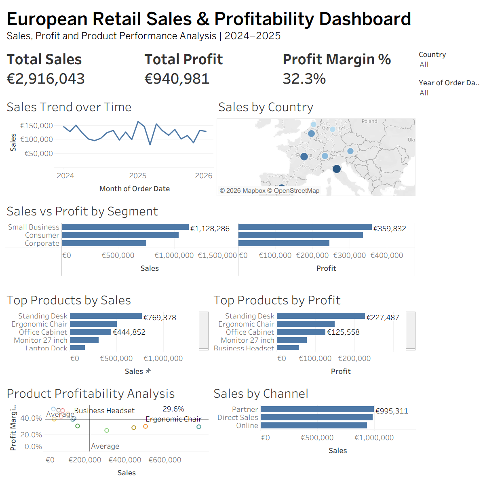

# European Retail Sales & Profitability Dashboard

## Project Overview

This project analyzes European retail sales data to evaluate sales performance, profitability, customer segments, product performance, sales channels, and geographic trends.

An interactive Tableau dashboard was developed to transform the cleaned retail dataset into business insights and provide users with the ability to filter results by country and year.

## Business Objectives

The analysis aims to answer the following questions:

- How are sales performing over time?
- Which countries generate the highest sales?
- Which customer segments generate the most sales and profit?
- Which segments have the highest profit margins?
- Which products generate the highest sales and profit?
- How does product sales performance relate to profitability?
- Which sales channels generate the most revenue?

## Tools Used

- **Microsoft Excel** — Data cleaning and preparation
- **Tableau** — Data visualization, analysis, calculated fields, and interactive dashboard development

## Data Preparation

Before visualization, the dataset was cleaned and validated in Excel. The preparation process included:

- Removing duplicate records
- Handling missing values
- Correcting and standardizing city names
- Standardizing customer segments and categories
- Validating discount values
- Checking data types
- Validating Sales, Cost, and Profit fields
- Preparing the cleaned dataset for Tableau analysis

## Tableau Analysis

The project includes:

- KPI cards for Total Sales, Total Profit, and Profit Margin
- Monthly Sales Trend
- Sales by Country
- Sales vs Profit by Customer Segment
- Profit Margin by Customer Segment
- Top Products by Sales
- Top Products by Profit
- Product Profitability Analysis
- Sales by Channel
- Interactive Country and Year filters

## Key KPIs

| KPI | Result |
|---|---:|
| Total Sales | €2.916M |
| Total Profit | €940,981 |
| Profit Margin | 32.3% |

## Key Business Insights

- Small Business generated the highest sales and absolute profit among customer segments.
- Corporate achieved the highest profit margin at approximately 32.7%.
- Standing Desk was the leading product in both sales and absolute profit.
- Partner was the highest-performing sales channel, generating approximately €995K in sales.
- Product-level analysis showed that high sales do not necessarily correspond to the highest profit margin.

## Dashboard Features

The dashboard allows users to:

- Filter the complete analysis by **Country**
- Filter performance by **Year**
- Compare sales and profitability across customer segments
- Analyze geographic sales distribution
- Identify high-performing products and sales channels

## Skills Demonstrated

- Data Cleaning
- Data Validation
- Tableau Calculated Fields
- KPI Development
- Geographic Analysis
- Top-N Analysis
- Reference Lines
- Product Profitability Analysis
- Interactive Filters
- Dashboard Design
- Business Insight Generation

## Dashboard Preview

## Author

**Rashmi**

Data Analytics Portfolio Project
